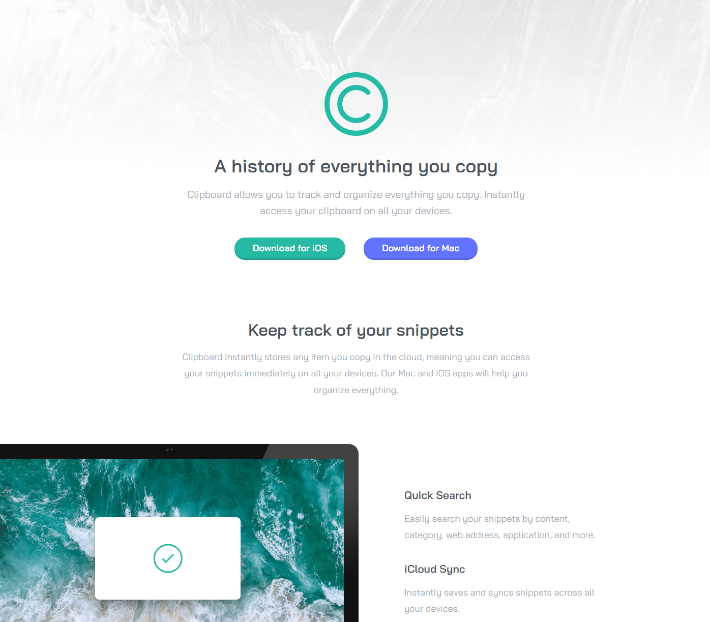

# Frontend Mentor - Clipboard landing page solution

This is a solution to the [Clipboard landing page challenge on Frontend Mentor](https://www.frontendmentor.io/challenges/clipboard-landing-page-5cc9bccd6c4c91111378ecb9). Frontend Mentor challenges help you improve your coding skills by building realistic projects.

## Table of contents

- [Overview](#overview)
  - [The challenge](#the-challenge)
  - [Screenshot](#screenshot)
  - [Links](#links)
- [My process](#my-process)
  - [Built with](#built-with)
  - [What I learned](#what-i-learned)
- [Author](#author)

## Overview

### The challenge

Users should be able to:

- View the optimal layout for the site depending on their device's screen size
- See hover states for all interactive elements on the page

### Screenshot

### Links

- Github URL: [Github URL](https://github.com/exchyphen/fm_clipboard-landing-page)
- Live Site URL: [live site hosted by Github Pages](https://exchyphen.github.io/fm_clipboard-landing-page/)

## My process

### Built with

- HTML
- CSS
- React

### What I learned

Practice with layouts, and general CSS classing. Good practice planning structure, shared classes, flexbox mobile design.

## Author

- Github - [exchyphen](https://github.com/exchyphen)
- Frontend Mentor - [@exchyphen](https://www.frontendmentor.io/profile/exchyphen)
